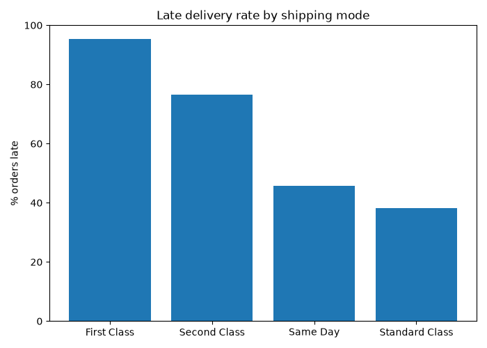
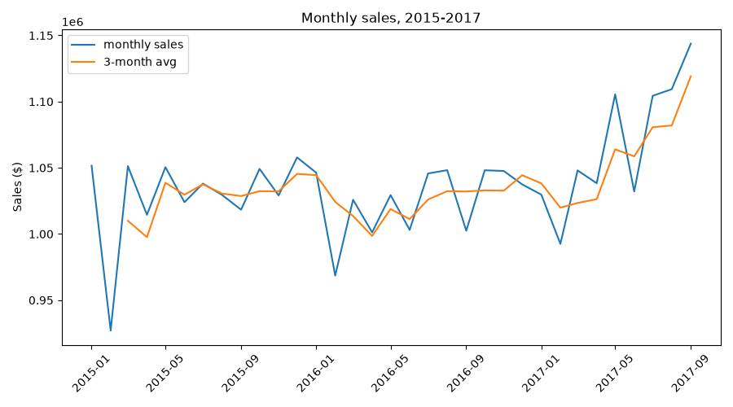
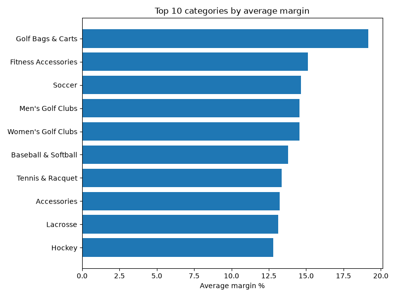

# Supply Chain SQL Analysis

SQL analysis of order and delivery data from DataCo's supply chain dataset (Kaggle, ~180k orders). PostgreSQL.

## Structure

- sql/ - queries, numbered in the order they were run
- scripts/ - python script that generates the charts below from the sql queries
- data/ - raw csv, not included in repo (see setup)
- visuals/ - charts

## Setup

1. Download the dataset: kaggle.com/datasets/shashwatwork/dataco-smart-supply-chain-for-big-data-analysis
2. Put DataCoSupplyChainDataset.csv in data/
3. Run the sql files in order:
psql supplychain_analytics -f sql/01_staging_schema.sql
psql supplychain_analytics -c "\COPY stg_supply_chain FROM 'data/DataCoSupplyChainDataset.csv' WITH (FORMAT csv, HEADER true, ENCODING 'LATIN1')"
psql supplychain_analytics -f sql/02_fact_orders.sql

CSV is latin-1 encoded, not utf-8, so that needs to be set in the COPY command or the load fails.

## Findings

First Class shipping is marked late 95% of the time, more than any other shipping mode. The promised delivery time (1 day) doesn't match what's actually achievable (avg 2 days), so almost every order counts as late. Standard Class promises 4 days and delivers in 4, so it looks better mainly because the target is realistic.

Delivery delay rate barely varies by region (53-58% across all regions), compared to a 38-95% range across shipping modes. Shipping mode is the real driver of delays here, not geography.

Monthly sales are flat around 1-1.1M from 2015 to Sept 2017, then drop by more than half almost overnight in October 2017, no gradual decline. Looks like a data cutoff rather than a real sales drop, so trend charts only go up to Sept 2017.

Margin varies a lot more within categories than between them, top products in each category (ranked with a window function) often outperform the category average by a wide margin.

sales column always equals quantity x price exactly. Discounts show up in order_item_total, not in sales.

## Notes

Left out PII columns (email, password, names, street address) and empty columns (product image, description) from the fact table.
